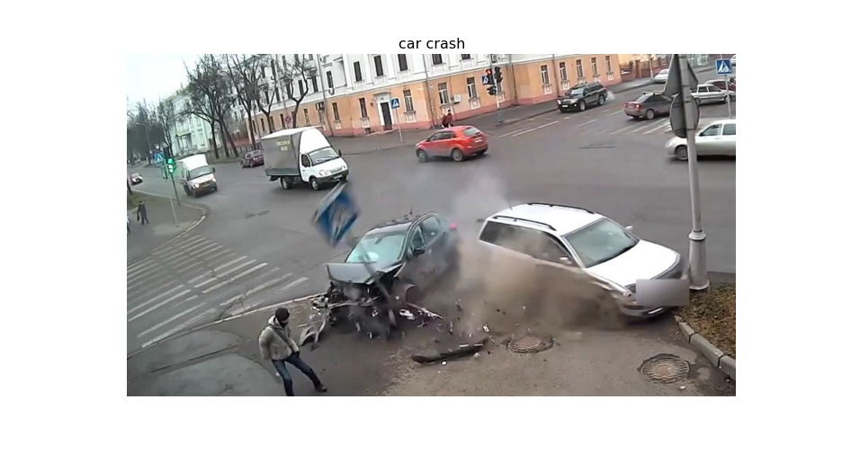
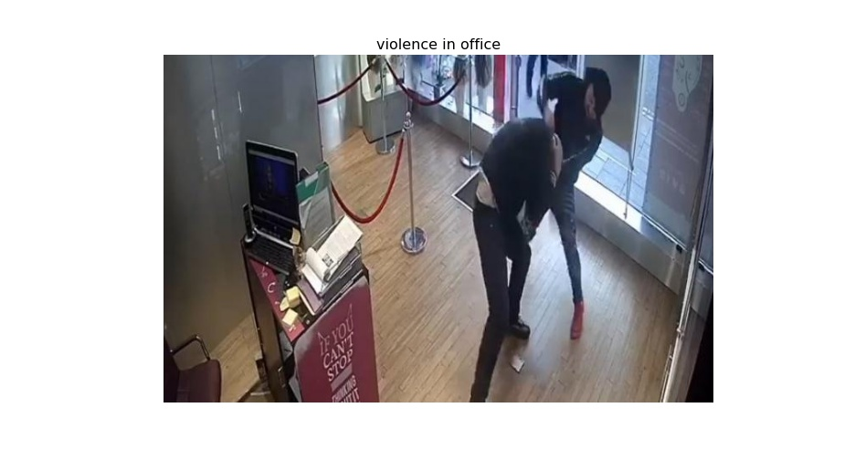
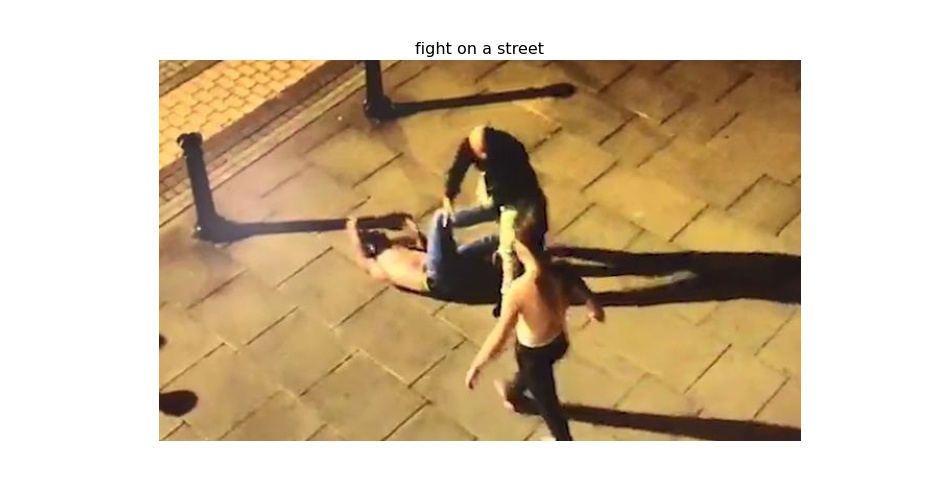
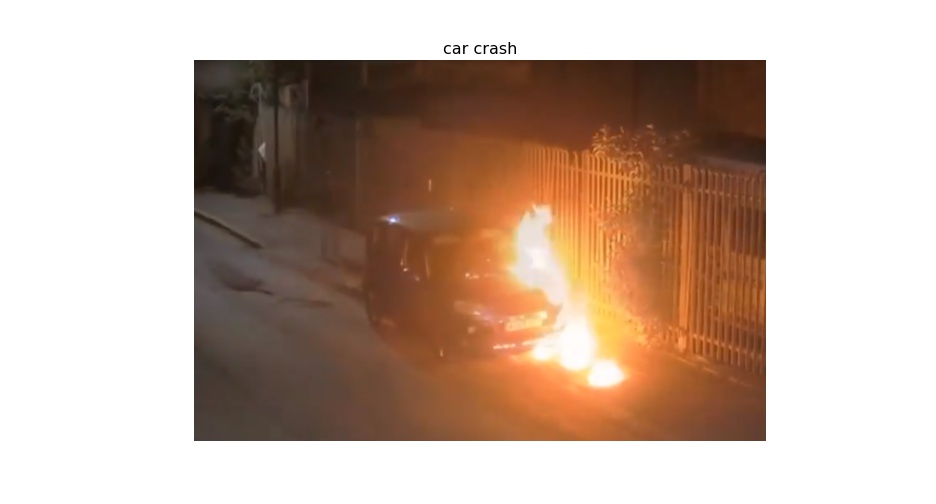
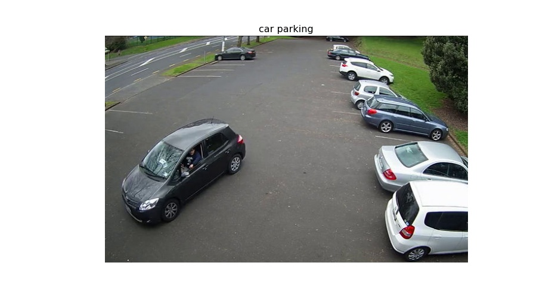

# Table of Contents

[Introduction](#introduction)

[How to Run](#howtorun)

[Resutls](#results)

[Further Work](#work)
<a name="introduction"/>

# Introduction

This repo presents code for Deep Learning based algorithm for
**detecting violence** in indoor or outdoor environments. The algorithm can
detect following scenarios with high accuracy: fight, fire, car crash and even
more.

To detect other scenarios you have to add **descriptive text label** of a
scenario in `settings.yaml` file under `labels` key. At this moment model can
detect 16`+1` scenarios, where one is default `Unknown` label. You can change,
add or remove labels according to your use case. The model is trained on wide
variety of data. The task for the model at training was to predict similar
vectors for image and text that describes well a scene on the image. Thus model
can generalize well on other scenarios too if you provide proper textual
information about a scene of interest.
<a name="howtorun"/>

# How to Run

First install requirements:
`pip install -r requirements.txt`

To test the model you can either run:
`python run.py --image-path ./data/7.jpg`

Or you can test it through web app:
`streamlit run app.py`

Or you can see the example code in `tutorial.ipynb` jupyter notebook

Or incorporate this model in your project using this code:

```python
from model import Model
import cv2

model = Model()
image = cv2.imread('./your_image.jpg')
image = cv2.cvtColor(image, cv2.COLOR_BGR2RGB)
label = model.predict(image=image)['label']
print('Image label is: ', label)
```

<a name="results"></a>

# Results

Below are the resulting videos and images. I used the model to make predictions
on each frame of the videos and print model's predictions on the left side of
frame of saved videos. In case of images, titles are model's predictions. You
can find code that produces that result in `tutorial.ipynb` jupyter notebook.


### Result Images









<a name="work"></a>

# Further Work

Needs further work for enhancements like: Batch processing support for speedup, return of
multiple suggestions, threshold fine-tuning for specific data, ect.
